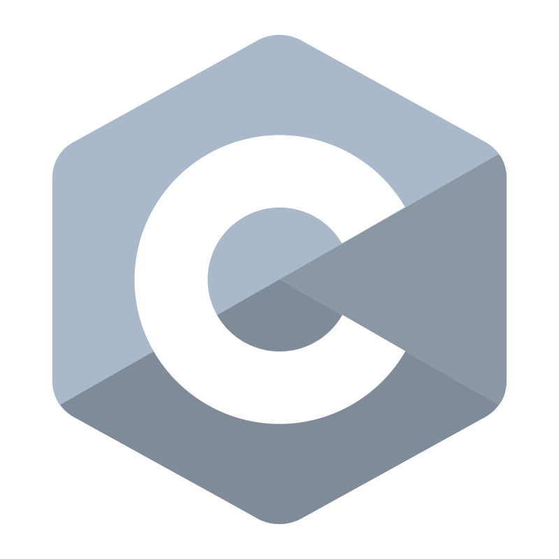
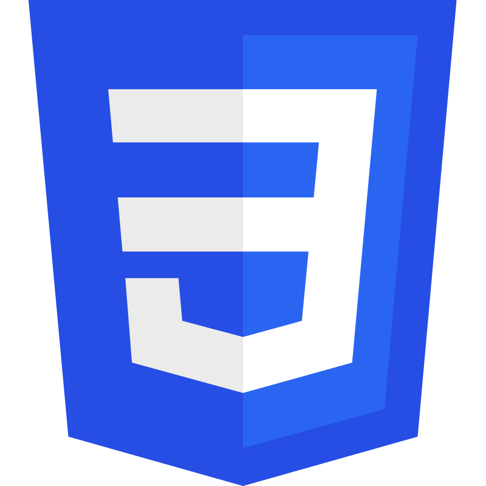
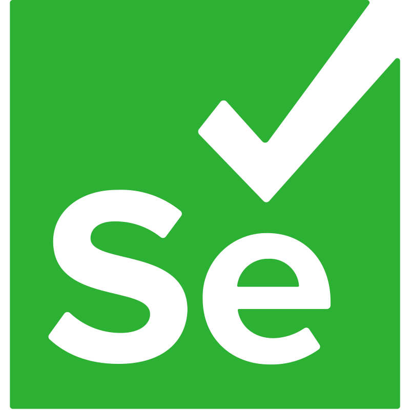
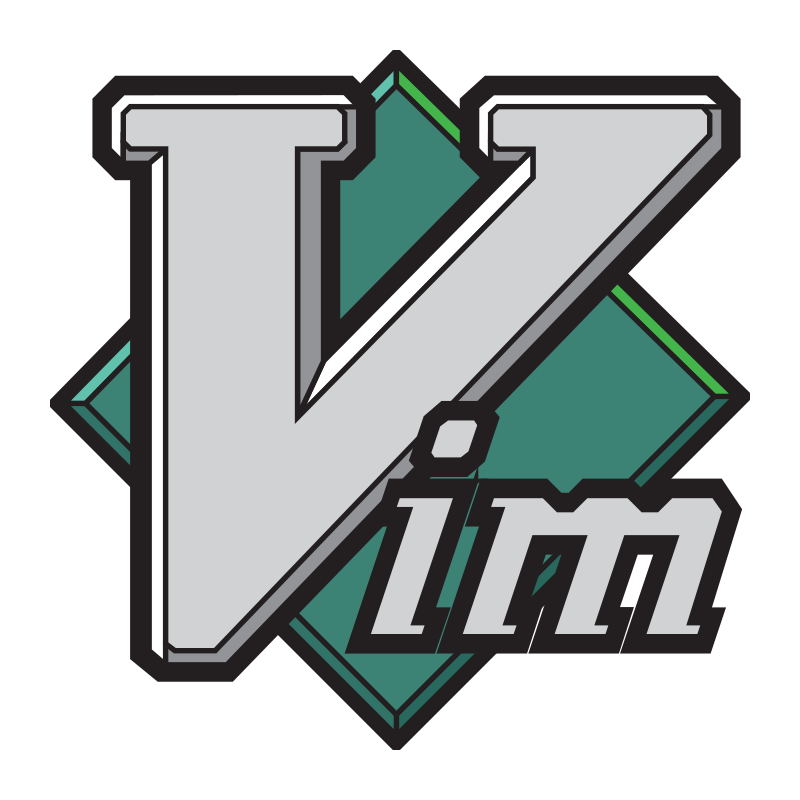
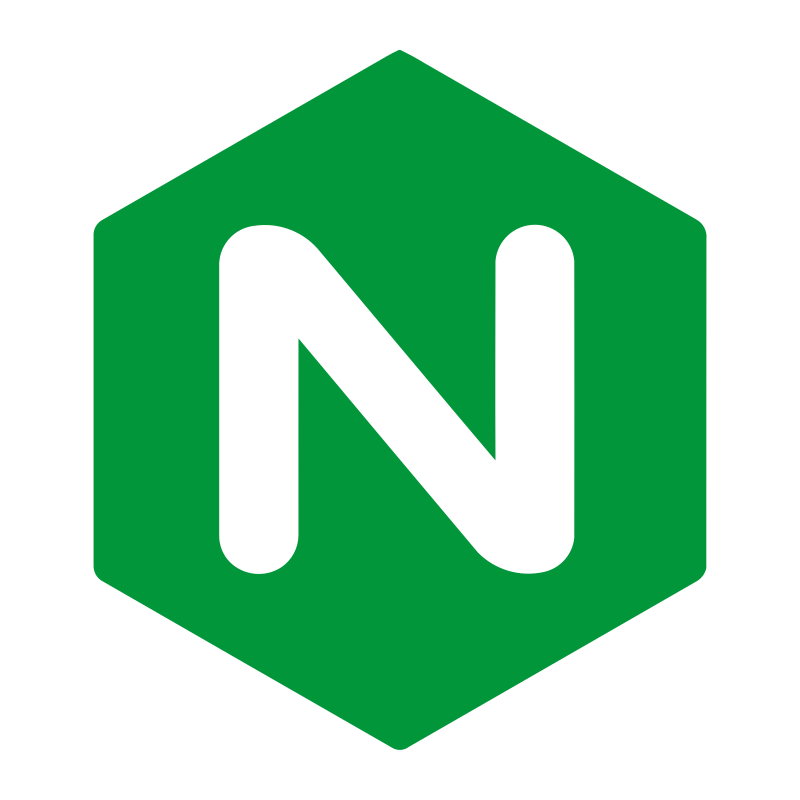



## About me
I am a middle Python backend developer based in Russia with a passion for learning new things in the IT field. I am particularly interested in open-source software, Linux, and all things related to these areas.

I strive to create automated solutions for various tasks that arise in my work. I would appreciate any assistance or advice you may be able to provide.

## 📚 My stack
### Languages

  
  
  
  
  
  

### Dev tools

  
  
  
  
  
  

### Software

  
  
  
  
  
  

