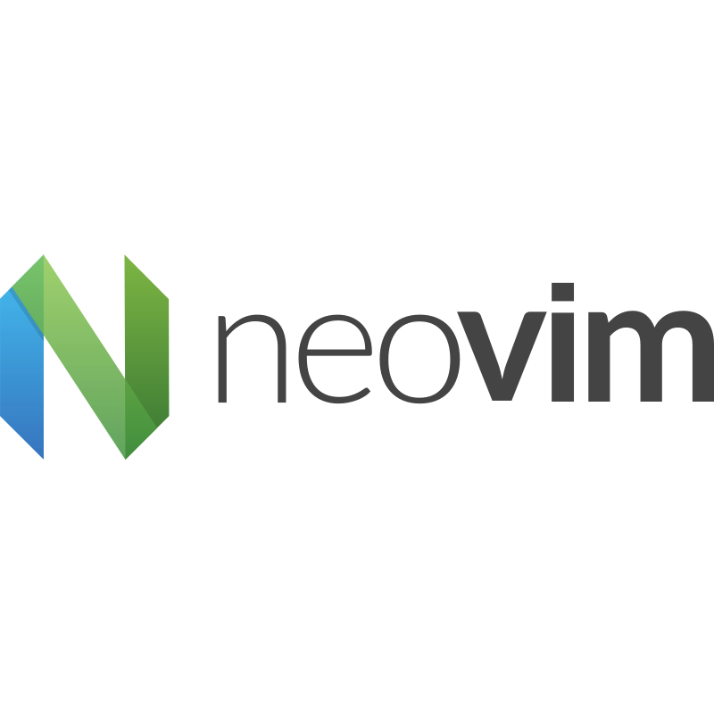



## About me
Я - мидл бэкенд разработчик на Python, работающий в России, и мне нравится изучать что-то новое в области информационных технологий. Меня особенно интересует программное обеспечение с открытым исходным кодом, Linux и все, что связано с этими областями.

Я стремлюсь создавать автоматизированные решения для различных задач, возникающих в моей работе. Я был бы признателен за любую помощь или совет, которые вы сможете мне предоставить.

---

I am a middle Python backend developer based in Russia with a passion for learning new things in the IT field. I am particularly interested in open-source software, Linux, and all things related to these areas.

I strive to create automated solutions for various tasks that arise in my work. I would appreciate any assistance or advice you may be able to provide.

## 📚 Мой стек технологий / My stack
### Языки Программирования / Programming Languages

  
  
  
  
  
  

### Инструменты разработки / Dev tools

  
  
  
  
  
  

### Программное обеспечение / Software

  
  
  
  
  
  

## 📧 Контакты / Contact
* Электронная почта / Email: un_but@vk.com
* Телеграм / Telegram: @un_but
